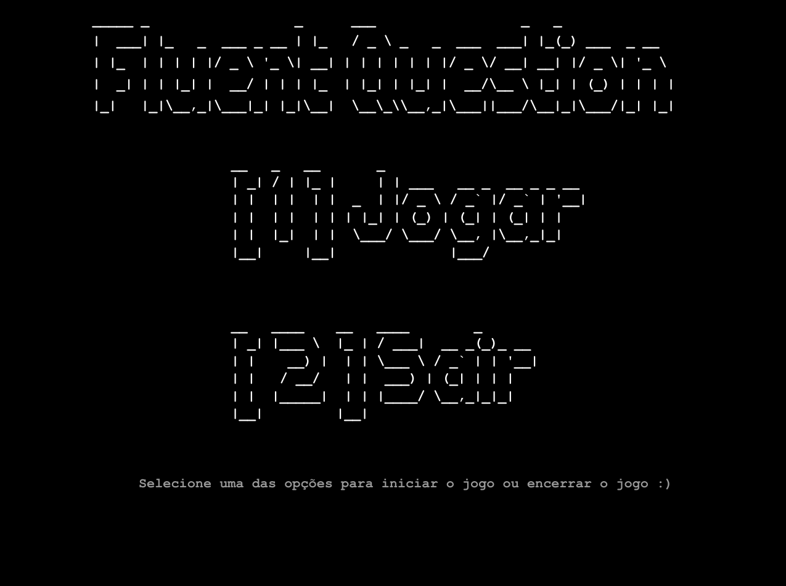
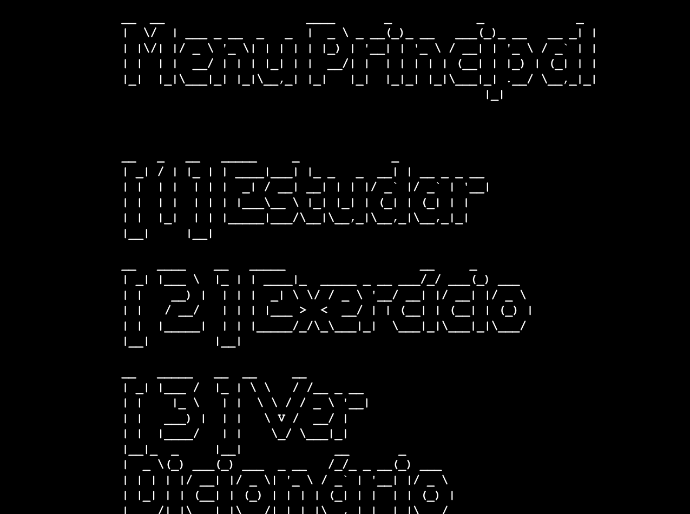
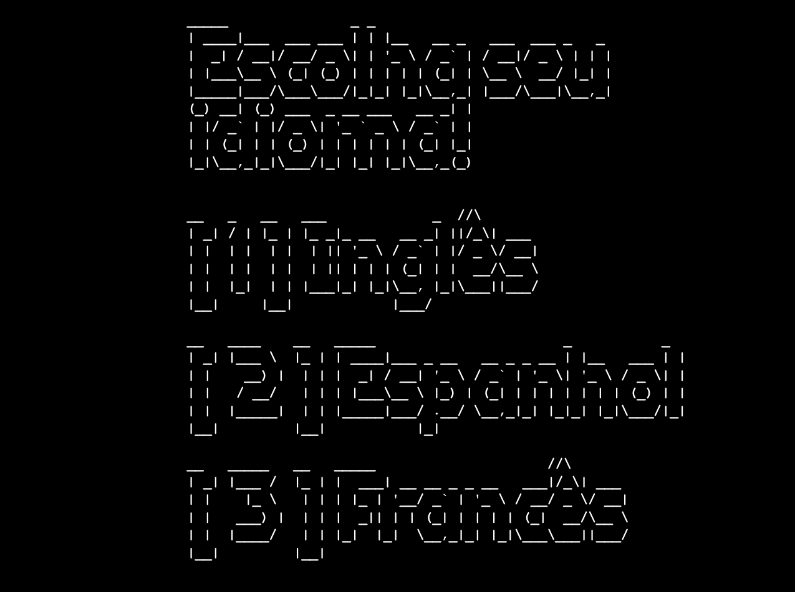
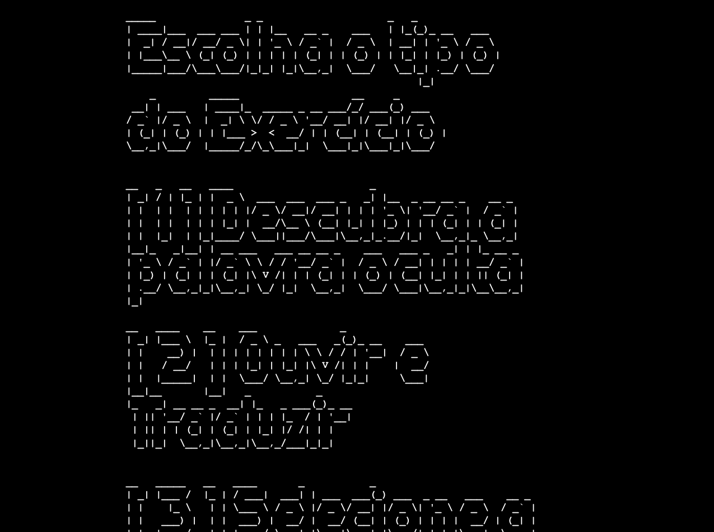
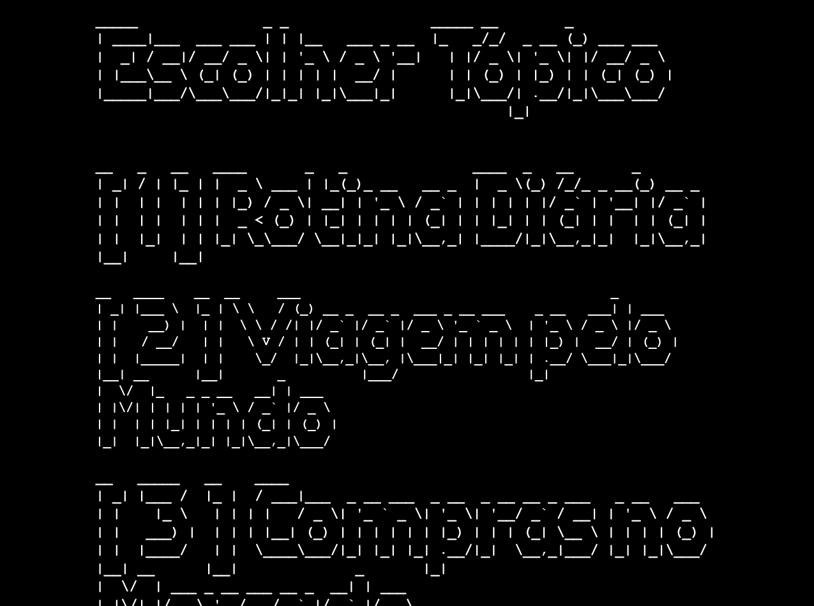
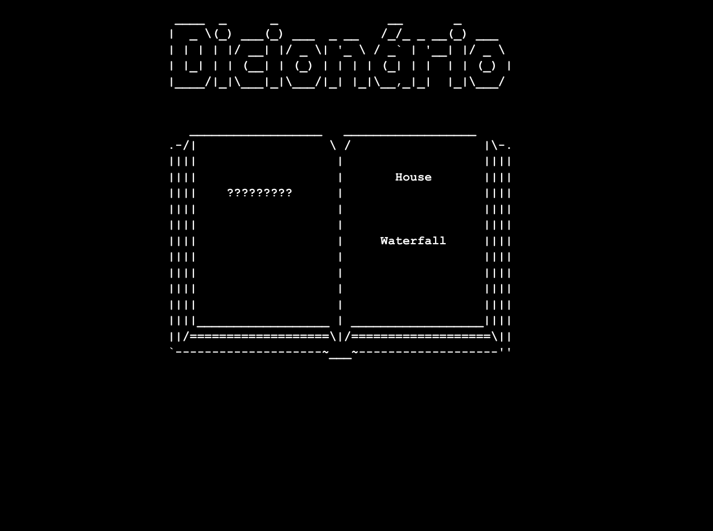

<div align="center">


<p align="center">
  <i>A fun and interactive terminal game to level up your language skills — one quest at a time.</i>
</p>

[](https://swift.org)
[](https://developer.apple.com/macos/)
[](https://developer.apple.com/xcode/)
[](LICENSE)

</div>

---

## 📑 Table of Contents

- [About](#-about)
- [Screens](#-screens)
- [Features](#-features)
- [Exercises & Study Modes](#-exercises--study-modes)
- [User Flow](#-user-flow)
- [Project Structure](#-project-structure)
- [Dependencies](#-dependencies)
- [Getting Started](#-getting-started)
- [Team](#-team)
- [License](#-license)

---

## ✨ About

**FluentQuest** is a fully interactive **terminal game** built in Swift that turns
language practice into a quest. Navigate hand-crafted ASCII-art menus, pick a
study topic, and sharpen your vocabulary through bite-sized minigames — listening
challenges, word puzzles, matching games and reading comprehension — all without
ever leaving your terminal.

> Built as a collaborative project to explore game design, terminal UX and
> text-to-speech entirely in Swift.

---

## 🖥️ Screens

<div align="center">

| Home | Main Menu | Language Select |
|:---:|:---:|:---:|
|  |  |  |

| Exercise Type | Study Menu | Dictionary |
|:---:|:---:|:---:|
|  |  |  |

</div>

---

## 🚀 Features

<div align="center">

|  Feature  | Description |
|:---------:|:------------|
| 🎮 Engaging minigames | Interactive challenges that make vocabulary stick |
| 🔊 Audio translation | Listen to a word or phrase and type the translation (text-to-speech) |
| 🧩 Hidden word puzzles | Guess the missing word inside a sentence |
| 📖 Reading comprehension | Read short passages and answer questions |
| 📚 Interactive dictionary | Look up and review every word you've learned |
| 🏆 Progress & rewards | Earn rewards as you advance through quests |
| 🎨 ASCII-art interface | Polished, hand-crafted terminal screens |

</div>

---

## 🧠 Exercises & Study Modes

<div align="center">

| Mode | What you do |
|:------:|:---------|
| 🗣️ **Terminal Falante** | The terminal *speaks* a word; you listen and translate |
| 🔗 **Ligue-Ligue** | Match words with their correct translation |
| 🔤 **Palavreco** | Word-guessing puzzle to test your vocabulary |
| 📚 **Dicionário** | Review all the words you have learned so far |

**Reading topics** (story-driven comprehension):
`🌍 Viagem pelo Mundo` · `🛒 Compras no Mercado` · `🌅 Rotina Diária`

</div>

---

## 🔀 User Flow

<div align="center">

</div>

---

## 📂 Project Structure

<div align="center">

| Module | Purpose |
|:-----:|:--------|
| `main.swift` | Entry point & main game loop (home navigation, SIGINT handling) |
| `Menu/` | Menus & navigation: language select, study topics, exercise and game-mode pickers, dictionary |
| `Exercícios/` | Core exercises: Palavreco, LigueLigue, TerminalFalante |
| `Historia/` | Reading-comprehension stories: ViagemMundo, RotinaDiaria, ComprasMercado |
| `PrintDosExs/` | ASCII-art rendering for each exercise |
| `Utils/` | Helpers: input validation, text-to-speech, terminal clearing, questions |

</div>

---

## 📦 Dependencies

```bash
Swift: >= 5.5
Xcode: >= 14 (command-line tool target)
```

---

## 🎯 Getting Started

```bash
# Clone the repository
git clone https://github.com/EnzoFerroni/FluentQuest.git

# Open the Xcode project
cd FluentQuest
open FluentQuest/FluentQuest.xcodeproj

# Build & run the command-line game in Xcode with ⌘R
```

> 💡 Best played in a terminal with a monospaced font and a dark background, so
> the ASCII-art screens line up perfectly.

---

## 👥 Team

<div align="center">
  <table>
    <tr>
      <td align="center" width="33%">
        <a href="https://github.com/EnzoFerroni" target="_blank"></a>
        <br/><sub><b>Enzo Ferroni</b></sub><br/><br/>
        <a href="https://github.com/EnzoFerroni" target="_blank"></a>
        <a href="https://www.linkedin.com/in/enzoferroni/" target="_blank"></a>
      </td>
      <td align="center" width="33%">
        <a href="https://github.com/Kleber-gadelha" target="_blank"></a>
        <br/><sub><b>Kleber Gadelha</b></sub><br/><br/>
        <a href="https://github.com/Kleber-gadelha" target="_blank"></a>
        <a href="https://www.linkedin.com/in/kleber-gadelha-917a6228b/" target="_blank"></a>
      </td>
      <td align="center" width="33%">
        <a href="https://github.com/matheussricardoo" target="_blank"></a>
        <br/><sub><b>Matheus Ricardo</b></sub><br/><br/>
        <a href="https://github.com/matheussricardoo" target="_blank"></a>
        <a href="https://www.linkedin.com/in/matheus-ricardo-426452266/" target="_blank"></a>
      </td>
    </tr>
  </table>
</div>

---

## 📄 License

Released under the [MIT License](LICENSE). © 2025 Enzo Ferroni, Kleber Gadelha and Matheus Ricardo.


